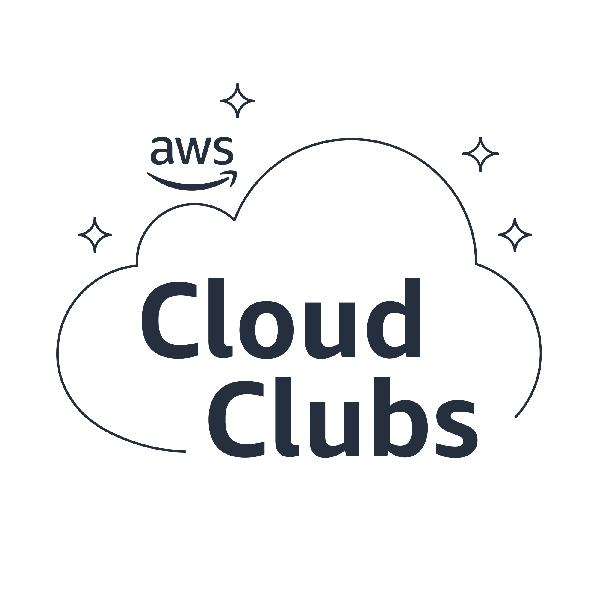

  <h1 align="center"><b>Welcome, Students and Educators!</h1>

&nbsp;
&nbsp;
&nbsp;
&nbsp;
 

I'm Jen Looper, Head of Academic Advocacy at AWS and I'm here to make AWS even more accessible and useful for the educational space. 

## Looking for an internship at AWS? 

[Internships for students](https://www.amazon.jobs/en/teams/internships-for-students)

## Student Resources

AWS services to try for free:

Are you a web developer? Try [AWS Amplify](https://aws.amazon.com/amplify/)

Interested in Data Science and Machine Learning? Try [Sagemaker Studio Labs](https://studiolab.sagemaker.aws/)

## Innovative online learning experiences:

[Deep Racer for Students](https://student.deepracer.com/)

[Machine Learning University Course](https://mlu-explain.github.io/)

[Cloud Quest](https://cloudquest.skillbuilder.aws/)

## Free courses:

[AWS Educate](https://www.awseducate.com)

[AWS SkillBuilder](https://explore.skillbuilder.aws)

[Serverlessland](https://serverlessland.com/)

## Upcoming free events near you:

[Global Summits](https://aws.amazon.com/events/summits/)

## Coming soon! 

AWS Cloud Clubs - a new student usergroup initiative. Become your region’s next Cloud Club Captain and build your skills and career with your peers
  
## AWS programs of interest to students:

  
| Program | Description | Target Persona/Audience | Availability | Reach |
| --- | --- | --- | --- | --- |
| [AWS InCommunities](https://w.amazon.com/bin/view/AWSCommunityEngagement/) | AWS InCommunities is a team within AWS's Infrastructure organization that focuses on community engagement by building and supporting global and local initiatives around science, technology, engineering, arts, and math (STEAM) education, equity, and access; tech upskilling; environmental stewardship; and employee engagement. They execute programs such as Girls' Tech Day, the Tech Week and Family Tech Series through a network of volunteers. | Tech Students | Free | Global |
| [AWS Educate](https://www.awseducate.com/) | Accelerates cloud learning to prepare individuals for the cloud-enabled jobs of tomorrow, and connects learners to jobs and employers | Students and builders(\>13 y.o) | Free | Global |
| [AWS re/Start](https://aws.amazon.com/training/restart/) | Focuses on unemployed and underemployed individuals for cloud careers through full-time, classroom-based training and connects them to employers. Launched in 2019, and as of March 2021 has registered 1,1k students enrolled and completed, in 15 countries | Unemployed/underemployed | Free | Global (not comprehensive) |
| [AWS Spark](https://w.amazon.com/bin/view/Iot-spark) | AWS Spark is an upcoming K12 program to encourage young learners to explore the AWS Cloud using hands-on activities with Internet-of-Things (IoT) technology. Currently in beta testing, includes a sandbox offering. | US-based high school educators and their students | Preview(Free) | US |
| [AWS Tech U](https://www.amazon.jobs/en/landing_pages/AWS-techu) | Accelerated workforce development program that helps early-career talent build technical and professional skills to jump-start careers at AWS globally. Residents are full-time, blue-badged L4 technical employees that transition into the different technical roles at AWS. | Graduates or early builders (\<2 years' experience) | Free | Global |
| Learner Engagement | AWS Learner Engagement works backward from employer needs to create opportunities for learners of all backgrounds and experiences to develop the applied learning and career readiness skills most valued. The aim is to prepare learners for in-demand, entry-level cloud roles. | Post-secondary Students Early builders | Free | Global |
| [Employer Engagement](https://aws.amazon.com/education/awseducate/aws-educate-employers/) | Connects AWS customers and partners with entry-level cloud talent graduating from T&C Education ProgramsLaunched in GA in 2018 and as of March 2021, they have registered over 2k AWS Education program alumni employed | Customers/partnersEarly builders | Free | Global |
| [WWPS Education](https://aws.amazon.com/education/higher-ed/) | AWS offers a number of supporting programs and resources to support students and educators, and our WWPS Education team offers support for organisations where teaching, learning, and research is the core business. The WWPS organization has specialist SAs within Public Sector focused on helping education institutions, [EdTech](https://rise.articulate.com/share/PHxGI5RZla4vYXuXYk7HYgNbMeruy43I#/lessons/WJJASW4WUo3wNUpqTNw7XMB-506vc9vw) startups and academic researchers understand and leverage AWS. | Institutions | Free | Global |

